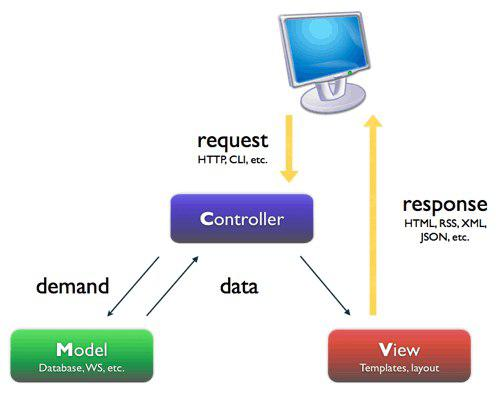
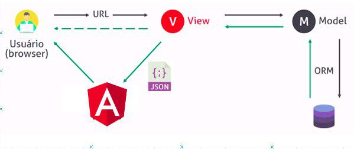
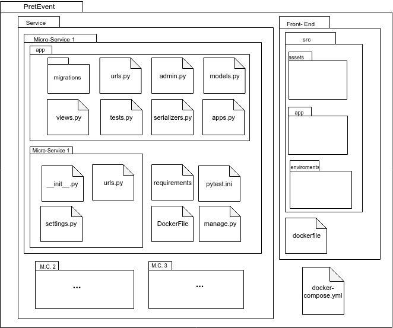
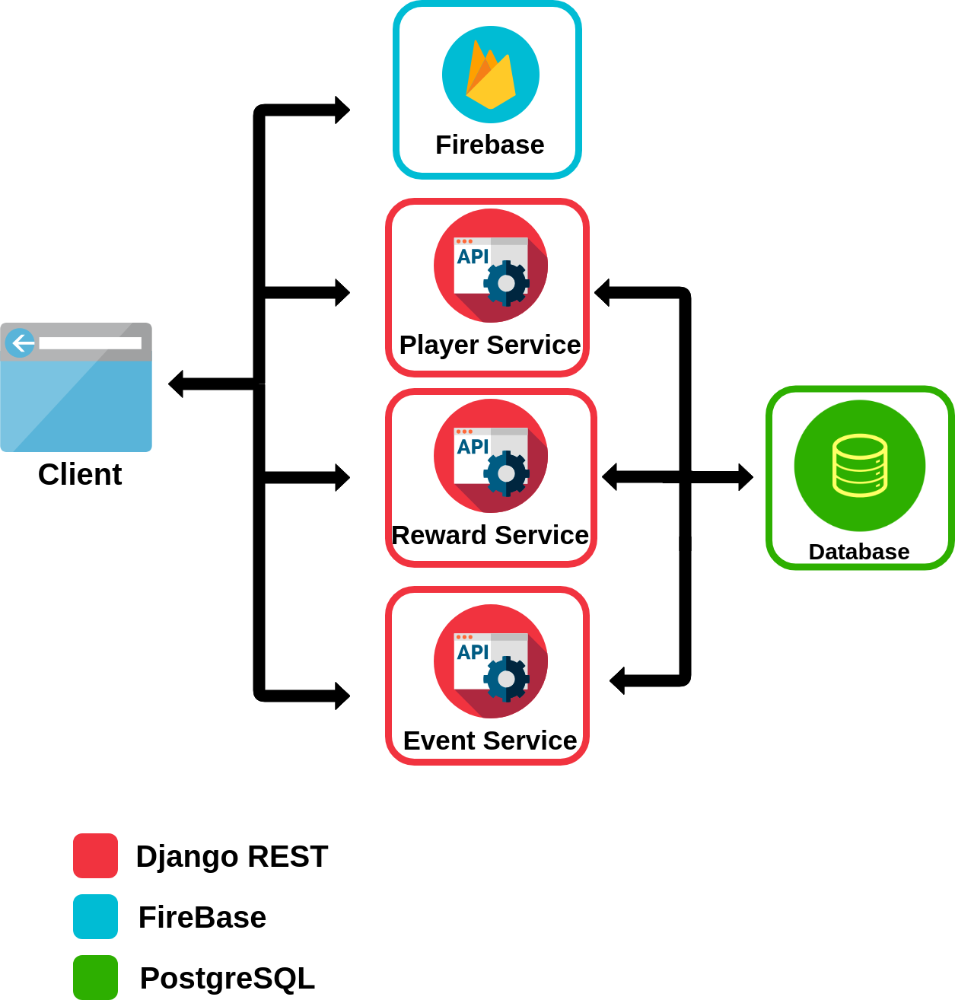
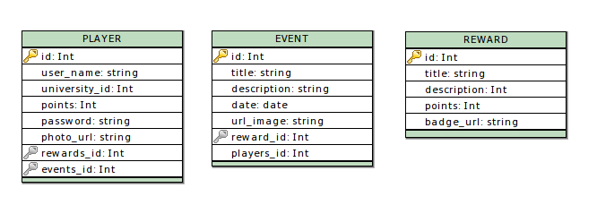

# Documento de Arquitetura
* 1. [Introdução](#1-introdução)
    * 1.1 [Finalidade](#11-finalidade)
    * 1.2 [Escopo](#12-escopo)
    * 1.3 [Definições, Acrônimos e Abreviações](#13-definições-acrônimos-e-abreviações)
    * 1.4 [Visão Geral](#15-visão-geral)
* 2. [Representação da Arquitetura](#2-representação-da-arquitetura)
* 3. [Metas e Restrições de Arquitetura](#3-metas-e-restrições-de-arquitetura)
* 4. [Visão de Casos de Uso](#4-visão-de-casos-de-uso)
* 5. [Visão Lógica](#5-visão-lógica)
* 6. [Arquitetura dos Serviços e Visão de Implementação](#6-arquitetura-de-derviços-e-visão-de-implementação)
* 7. [Visão de Dados](#7-visão-de-dados)

## 1. Introdução

### 1.1 Finalidade

&emsp;&emsp;Este documento apresenta uma visão geral abrangente da arquitetura do projeto PretEvent, utilizando de uma série de visões arquiteturais diferentes para ilustrar os diversos aspectos do sistema. Este projeto fora realizado na disciplina Métodos de Densenvolvimento de Software em conjunto com a disciplina Engenharia de Produto de Software, e possui como principal a comunidade academica da Universidade de Brasília campus Gama.

### 1.2 Escopo

&emsp;&emsp;Neste documento serão descritos os componentes de software, padrões arquiteturais adotados e frameworks escolhidos para o desenvolvimento do projeto que tem por objetivo a criação de um sistema capaz de envolver mais os alunos com as atividades realizadas no campus, através de um gamificação cujo objetivo é a participação em eventos. O aluno, por sua vez, podera usufrui de um ambiente ludico com elementos tradicionais de um rpg, como personagem, pontos de nivel e recompensas. O documento explora a fundo as características da arquitetura e como estas se relacionam com o projeto.

### 1.3 Definições, Acrônimos e Abreviações
* Player: Usuário do sistema.
* Evento: Evento ou atividade onde o player poderá ganhar pontos e/ou itens
* Recompensa: Itens de estilo para o avatar do player e/ou pontos de experiência.
* MVC: model-view-controller
* MVT: model-view-template
* Back-end: Camada de serviços da aplicação
* Front-end: Camada de apresentação da aplicação

### 1.4 Visão Geral

&emsp;&emsp;O presente documento faz o detalhamento e descrição de características da arquitetura escolhidas pela equipe de desenvolvimento para a solução no software do projeto PretEvent. Nele estará presente: Representação da Arquitetura, Metas e Restrições de Arquitetura, Visão Lógica, Visão de Lógica, Visão de Processos, Visão de Implantação, Visão de Implementação, Visão de Dados, Tamanho e Desempenho, Qualidade e Referências bibliográficas.

## 2. Representação da Arquitetura

&emsp;&emsp;A arquitetura utilizada é composta de três micro serviços implementados com o framework Django, em conjunto com serviços de banco de dados PostgreSQL e um servidor web implementado com framework AngularJS. O principal papel do Django é a implementação de uma API que, em conjunto com a sua extensão Django-Rest framework, possibilita a criação de uma API RestFull. Assim, cada micro serviço disponibilizará uma API RestFull que serão consumidas pelo framework de frontend (Angular). O serviço de banco de dados (PostgreSQL) será responsável pela persistência das entidades implementadas nos micro serviços e possibilitarão a conexão entre os mesmos.

&emsp;&emsp;O framework Django, segundo sua documentação (DjangoBook), segue o padrão MVC suficientemente para que seja considerado um framework MVC com a única diferença que, neste framework, o padrão recebe o nome de MVT, entretanto deve-se salientar a diferença entre os padrões arquiteturais.

&emsp;&emsp;No padrão MVC clássico, a aplicação é dividida em três principais componentes interconectados, sendo esses:

 * 
<b>Model</b> : é responsável por tratar a parte lógica relacionada aos dados, sua estrutura, consultas e validação. Deve-se também atentar as regras de negócio relacionadas a persistência dos dados no banco de dados.

 * 
<b>View</b> : é responsável pela interação com o usuário, definindo também quais são as regras de experiências de usuário desejadas. É importante ressaltar que a view possui comunicação somente com a camada Controller.

 * 
<b>Controller</b> : efetua a comunicação entre a Model e a View. Nessa camada são explicitadas as regras comerciais referentes a manipulação do sistema. Em resumo, é responsável por acessa os dados providos pela Model, manipulá-los e serví-los a camda View.

 

&emsp;&emsp;O padrão MVT faz um paralelo com o MVC clássico com a diferença de quê, a camada que recebe o nome View é responsável pelas atribuições da Controller e a antiga camda View recebe o nome de Template. Podemos definir então o padrão MVT como:

  * 
<b>Model</b> : possui a mesma finalidade da Model do MVC com a excessão de o framework Django nos auxiliar com a comunicação com o banco de dados através de bibliotecas próprias.

  * 
<b>View</b> : essa camada contém a lógica de negócio, fazendo conexão com a Model, trabalhando os dados e servindo a camada de Template. É similar a camada Controller de um MVC clássico.

  * 
<b>Template</b> : nesta camada é definido como será feita a interação com o usuário da mesma forma que a View em um MVC clássico. Recebe da View os dados já trabalhados e os apresenta para o usuário da forma apropriada.

&emsp;&emsp;Utilizamos também o Django-Rest framework. Essa ferramenta auxilia na construção da API RestFull, além de várias outras ferramentas. Uma das ferramentas mais importantes é a serializer que possibilita a transformação de dados JSON em objetos Python. É sabido que as requisições web podem transmitir somente conteúdo de texto. Assim, através de uma RestFull, é possível a manipulação de objetos, recebendo e enviando somente arquivos JSON.

## 3. Metas e Restrições de Arquitetura

&emsp;&emsp;O projeto PretEvent possui as seguintes metas:

- 
Compatibilidade com os principais browsers da atualidade: Mozilla Firefox, Google Chrome e Internet Explorer;

- 
Modularidade: o código deve ter baixo acoplamento e alta modularidade, para facilitar a manutenabilidade.

&emsp;&emsp;Há, também, as seguintes restrições:

* 
Framework Django 2.0.3 com Python 3.5.2;

* 
Django REST: um framework utilizada para construção de WEB APIs;

* 
Banco de dados relacional PostgreSQL, pois o sistema deverá ser executado em produção;

  
* 
Padrão MVT adapatado com Angular js cumprindo o papel da camada Template, utilizado pelo framework Django;

  
* 
Angular js: uma framework javascript para construção de interfaces de usuário, no sistema irá substituir a camada Template do padrão MVT.

## 4. Visão de Casos de Uso

## 5. Visão Lógica

### 5.1 Visão Geral: Pacotes e Camadas

&emsp;&emsp;O framework Django organiza os projetos em apps, que são pastas que contêm uma funcionalidade independente do restante da aplicação. Além disso, existem arquivos de configuração e arquivos estáticos globais. A figura a seguir mostra a organização de pastas do projeto.

* 
<b>micro_service_1/</b> : Neste diretório são armazenados todos os arquivos referentes ao back-end da aplicação. Na imagem acima está explicitado os arquivos e diretórios mais importantes para um unico micro serviço (micro serviço 1). Cada micro serviço é um projeto Django independente, e, como já explicado ateriormente, é baseado em apps. Cada micro serviço do PretEvent conta com apensa um app (diretório 'app' da imagem) e o diretório de configurações (sub diretório 'micro service 1' na imagem).

* 
<b>micro_service_1/DockerFile</b> : Arquivo Docker para levantar o container do micro serviço

* 
<b>micro_service_1/manage.py</b> : Arquivo Gerado pelo proprio framework, responsavel por fazer as principais ações da aplicação Django.

* 
<b>micro_service_1/requirements</b> : Arquivos com as dependecias do serviço.

* 
<b>micro_service_1/pytest.ini</b> : Arquivo de configuração dos testes unitários.

* 
<b>micro_service_1/micro_service_1/settings.py</b> : Contém as configurações básicas da aplicação Django.

* 
<b>micro_service_1/micro_service_1/urls.py</b> : Contém as rotas 'root' da aplicação

* 
<b>micro_service_1/app/urls.py</b> : Contém as rotas específicas dentro do domínio do app.

* 
<b>micro_service_1/app/admin.py</b> : Configurações para controle do app quando entrar no modo admin do serviço

* 
<b>micro_service_1/app/models.py</b> : Contém os modelos que serão persistidos no sistema.

* 
<b>micro_service_1/app/views.py</b> : Contém a lógica e toda a regra negocial do sistema.

* 
<b>micro_service_1/app/serializer.py</b> : Faz a serialização dos dados, transformando texto em objetos python e vice-versa.

## 6. Arquitetura dos Serviços e Visão de Implantação

&emsp;&emsp;Nesta seção está descrita descrita a estrutura geral das camadas e Micro Serviços integrados ao software, detalhando e apresentando a interação entre os diversos serviços e sistemas. Os principais componentes e sub-componentes estão descritos nos tópicos a seguir.

#### 6.1 Visão Geral

### 6.1 Micro Serviços

&emsp;&emsp;Os micro serviços presentes no diagrama estão detalhados abaixo, descrevendo suas comunicações, conexões e justificativas para a escolha dos mesmos.

#### 6.1.1 Serviço de Players

&emsp;&emsp;Este será o serviço que irá administrar toda a parte ligada aos players do jogo. Por se estar instricicamente ligado a parte de login, este serviço será responsavel por estas funções também. Foi escolhido serapar este recurso como um serviço já que pode ser desenvolvido separado do restante da aplicação e seu funcionamento é independente do restante dos recursos.

#### 6.1.2 Serviço de Eventos

&emsp;&emsp;Este será o serviço que irá administrar toda a parte ligada aos eventos dos players. Pode ser assim como o serviço dos players, pode ser desenvolvida independentemente dos restante do sistema.

#### 6.1.3 Serviço de Rewards

&emsp;&emsp;Este será o serviço que irá administrar toda a parte ligada aos rewards que os players receberam pelo cumprimento, ou participação dos eventos.

#### 6.2 PostgreSQL

&emsp;&emsp;Banco de dados relacional com tecnologia software livre, será armazenados todos os dados dos três seriços.

#### 6.2 NGINX

&emsp;&emsp;Servidor de HTTP e proxy reverso, para disponibilizar recursos para a camada do front-end. Foi escolhido para integração no sistema por ser gratuito, open source e ter alta performance.

## 7. Visão de Dados

