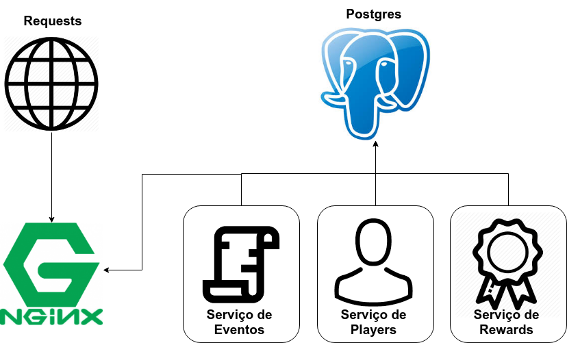

# Documento de Arquitetura
----------------
* 1. [Introdução](#1-introdução)
    * 1.1 [Finalidade](#11-finalidade)
    * 1.2 [Escopo](#12-escopo)
    * 1.3 [Definições, Acrônimos e Abreviações](#13-definições-acrônimos-e-abreviações)
    * 1.4 [Visão Geral](#15-visão-geral)
* 2. [Representação da Arquitetura](#2-representação-da-arquitetura)
* 3. [Metas e Restrições de Arquitetura](#3-metas-e-restrições-de-arquitetura)
* 4. [Visão de Casos de Uso](#4-visão-de-casos-de-uso)
* 5. [Visão Lógica](#5-visão-lógica)
* 6. [Arquitetura dos Serviços e visão de Implementação](#6-arquitetura-de-derviços-e-visão-de-implementação)
* 7. [Visão de Dados](#7-visão-de-dados)

### 1. Introdução

#### 1.1 Finalidade
Este documento apresenta uma visão geral abrangente da arquitetura do projeto PretEvent, utilizando de uma série de visões arquiteturais diferentes para ilustrar os diversos aspectos do sistema. Este projeto fora realizado na disciplina Métodos de Densenvolvimento de Software em conjunto com a disciplina Engenharia de Produto de Software, e possui como principal a comunidade academica da Universidade de Brasília campus Gama.
#### 1.2 Escopo
Neste documento serão descritos os componentes de software, padrões arquiteturais adotados e frameworks escolhidos para o desenvolvimento do projeto que tem por objetivo a criação de um sistema capaz de envolver mais os alunos com as atividades realizadas no campus, através de um gamificação cujo objetivo é a participação em eventos. O aluno, por sua vez, podera usufrui de um ambiente ludico com elementos tradicionais de um rpg, como personagem, pontos de nivel e recompensas. O documento explora a fundo as características da arquitetura e como estas se relacionam com o projeto.
#### 1.3 Definições, Acrônimos e Abreviações
* Player: Usuário do sistema.
* Evento: Evento ou atividade onde o player poderá ganhar pontos e/ou itens
* Recompensa: Itens de estilo para o avatar do player e/ou pontos de experiência.
* MVC: model-view-controller
* MVT: model-view-template
#### 1.4 Visão Geral
O presente documento faz o detalhamento e descrição de características da arquitetura escolhidas pela equipe de desenvolvimento para a solução no software do projeto PretEvent. Nele estará presente: Representação da Arquitetura, Metas e Restrições de Arquitetura, Visão Lógica, Visão de Lógica, Visão de Processos, Visão de Implantação, Visão de Implementação, Visão de Dados, Tamanho e Desempenho, Qualidade e Referências bibliográficas.
### 2. Representação da Arquitetura

### 3. Metas e Restrições de Arquitetura
O projeto Tropical Hazards possui as seguintes metas:

Compatibilidade com os principais browsers da atualidade: Mozilla Firefox, Google Chrome e Internet Explorer
Modularidade: o código deve ter baixo acoplamento e alta modularidade, para facilitar a manutenabilidade
Há, também, as seguintes restrições:

Framework Django 2.0.3 com Python 3.5.2
Django REST: um framework utilizada para construção de WEB APIs
Banco de dados relacional PostgreSQL, pois o sistema deverá ser executado em produção
Padrão MVT adapatado com Angular js cumprindo o papel da camada Template, utilizado pelo framework Django
Angular js: uma framework javascript para construção de interfaces de usuário, no sistema irá substituir a camada Template do padrão MVT
### 4. Visão de Casos de Uso

### 5. Visão Lógica

#### 5.1 Visão Geral: Pacotes e Camadas
O framework Django organiza os projetos em apps, que são pastas que contêm uma funcionalidade independente do restante da aplicação. Além disso, existem arquivos de configuração e arquivos estáticos globais. A figura a seguir mostra a organização de pastas do projeto.

### 6. Arquitetura dos Serviços e visão de Implementação
Nesta seção está descrita descrita a estrutura geral das camadas e Micro Serviços integrados ao software, detalhando e apresentando a interação entre os diversos serviços e sistemas. Os principais componentes e sub-componentes estão descritos nos tópicos a seguir.

#### 6.1 Visão Geral

#### 6.1 Micro Serviços
Os micro serviços presentes no diagrama estão detalhados abaixo, descrevendo suas comunicações, conexões e justificativas para a escolha dos mesmos.

##### 6.1.1 Serviço de Players
Este será o serviço que irá administrar toda a parte ligada aos players do jogo. Por se estar instricicamente ligado a parte de login, este serviço será responsavel por estas funções também. Foi escolhido serapar este recurso como um serviço já que pode ser desenvolvido separado do restante da aplicação e seu funcionamento é independente do restante dos recursos. 

### 7. Visão de Dados
