# Teste CI

## Work Flow

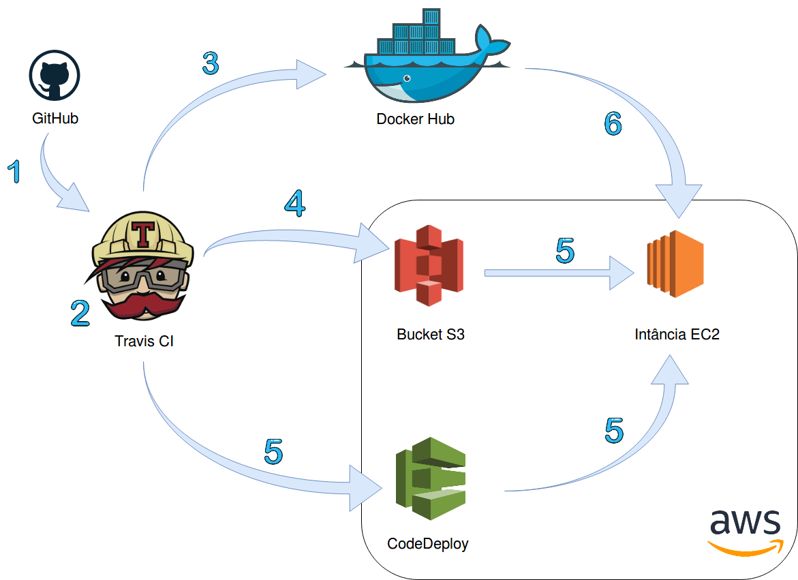

1. Merge Pull Request na master

2. Travis faz a build do projeto e executa os testes

3. Travis faz o push das images para o DockerHub

4. Travis faz o upload dos scripts zipados para o AWS Bucket S3

5. Travis avisa o AWS CodeDeploy para a instância AWS EC2 pegar os scripts do Bucket e executá-los

6. Instância AWS EC2 atualiza os serviços em execução em um Docker Swarm fazendo o pull das images do Docker Hub

## Tutorial
1. Criar contas
2. Política para a instância EC2
3. Políticas para o Travis CI
4. Criar usuário para o Travis User no AWS IAM
5. Criar IAM Role para instância EC2
6. Criar IAM Role para a aplicação AWS CodeDeploy
7. Criar a instância EC2
8. Criar o S3 Bucket
9. Configurar o AWS CodeDeploy
10. Configurar o projeto
11. Configurar as credenciais de usuário no Travis
12. Configurar o AWS CodeDeploy Agent


### 1. Criar contas

+ Criar conta no [Travis CI](https://travis-ci.com/)

+ Criar conta na [AWS](https://portal.aws.amazon.com/billing/signup)

### 2. Política para a instância EC2
Esse passo e os seguintes são executados no AWS Management Console (encontrado em "My Account" no canto superior direito em [aws.amazon.com](https://aws.amazon.com/)).

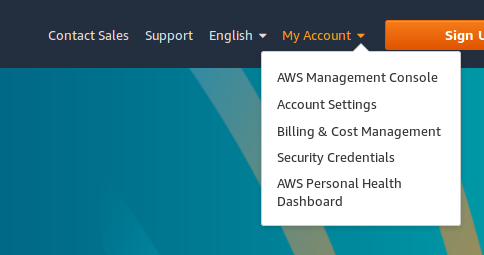

#### 2.1. Objetivo
Criar uma política no AWS Management Console para que a a instância EC2 tenha permissão para "pegar" qualquer arquivo de um serviço S3. Depois, essa política será atrelada a um "Role" para a instância EC2.

#### 2.2. Criar política
Em "Find Services", procurar por IAM.

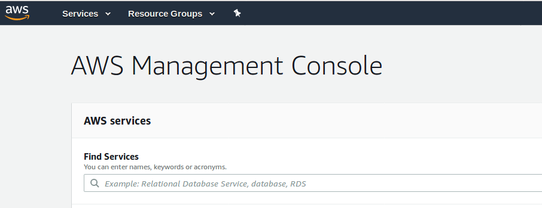

Em IAM, clicar em "Policies".

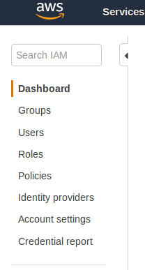

Depois clicar no botão azul "Create policy" e na aba "JSON" substituir o conteúdo pelo abaixo:
```
{
    "Version": "2012-10-17",
    "Statement": [
        {
            "Action": [
                "s3:Get*",
                "s3:List*"
            ],
            "Effect": "Allow",
            "Resource": "*"
        }
    ]
}
```
Clicar em "Review policy" e então dar um nome para ela como "CodeDeploy-EC2-Permissions" e clicar em "Create policy".

Para ver suas políticas criadas, em IAM, "Policies", clicar em "Filter policies" e selecionar "Customer managed".

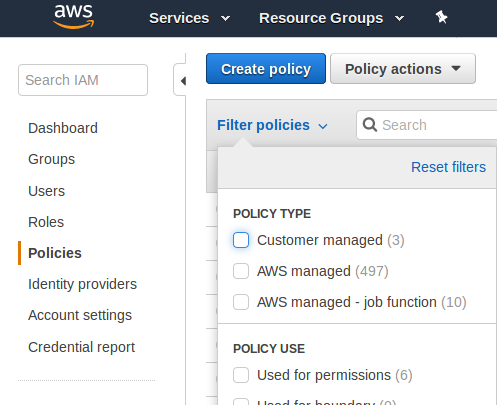

### 3. Políticas para o Travis CI

#### 3.1. Objetivo
Criar duas políticas no AWS Management Console para que o Travis possa enviar arquivos para o Bucket S3 e outra para que o Travis possa "avisar" o AWS CodeDeploy para a instância AWS EC2 "pegar" os arquivos no Bucket. Depois, essas políticas serão atreladas a um "Role" para o Travis.

#### 3.2. Criar políticas

##### 3.2.1. Upload para o S3 Bucket
Em IAM, "Policies", clicar no botão azul "Create policy" e na aba "JSON" substituir o conteúdo pelo abaixo:

```
{
    "Version": "2012-10-17",
    "Statement": [
        {
            "Effect": "Allow",
            "Action": [
                "s3:PutObject"
            ],
            "Resource": [
                "*"
            ]
        }
    ]
}
```
Clicar em "Review policy" e então dar um nome para ela como "Travis-Deploy-To-S3" e clicar em "Create policy". Essa polítiva permite o Travis fazer o upload de arquivos para o serviço AWS S3.

##### 3.2.2. Deploy para a instância EC2
Em IAM, "Policies", clicar no botão azul "Create policy" e na aba "JSON" substituir o conteúdo pelo abaixo trocando "REGIAO" pelo código da região onde a istância está hospedada, "ACCID" pelo seu AccId e "NOMEAPLICACAOCODEDEPLOY" para um nome a sua escolha:
```
{
    "Version": "2012-10-17",
    "Statement": [
        {
            "Effect": "Allow",
            "Action": [
                "codedeploy:RegisterApplicationRevision",
                "codedeploy:GetApplicationRevision"
            ],
            "Resource": [
                "arn:aws:codedeploy:REGIAO:ACCID:application:NOMEAPLICACAOCODEDEPLOY"
            ]
        },
        {
            "Effect": "Allow",
            "Action": [
                "codedeploy:CreateDeployment",
                "codedeploy:GetDeployment"
            ],
            "Resource": [
                "*"
            ]
        },
        {
            "Effect": "Allow",
            "Action": [
                "codedeploy:GetDeploymentConfig"
            ],
            "Resource": [
                "arn:aws:codedeploy:REGIAO:ACCID:deploymentconfig:CodeDeployDefault.OneAtATime",
                "arn:aws:codedeploy:REGIAO:ACCID:deploymentconfig:CodeDeployDefault.HalfAtATime",
                "arn:aws:codedeploy:REGIAO:ACCID:deploymentconfig:CodeDeployDefault.AllAtOnce"
            ]
        }
    ]
}
```
A região onde a istância está hospedada pode ser encontrada no AWS Management Console em EC2 Dashboard: 

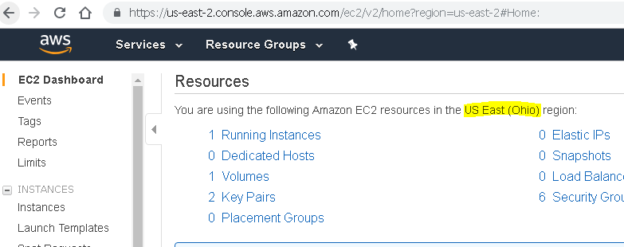

O código da região que deve ser trocado pode ser encontrado nessa [tabela](https://docs.aws.amazon.com/general/latest/gr/rande.html#codedeploy_region)

O AccId pode ser encontrado no Dashboard do IAM. O AccId é a sequência de números no começo do link para login de usuários do IAM:

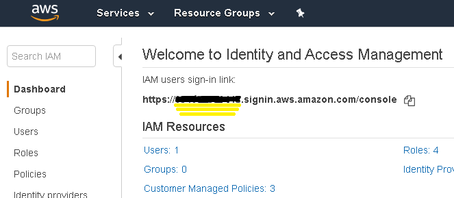

Clicar em "Review policy" e então dar um nome para ela como "Travis-Code-Deploy-Policy" e clicar em "Create policy".


### 4. Criar usuário para o Travis User no AWS IAM
Em IAM, clicar "Users", e depois clicar no botão azul "Add user". Então dar um nome para o usuário como "Travis", selecionar "Programmatic access" em "Access type" e clicar no botão azul "Next: Permissions".

Selecionar "Attach existing policies directly" em "Set permissions", clicar em "Filter policies" e selecionar "Customer managed".

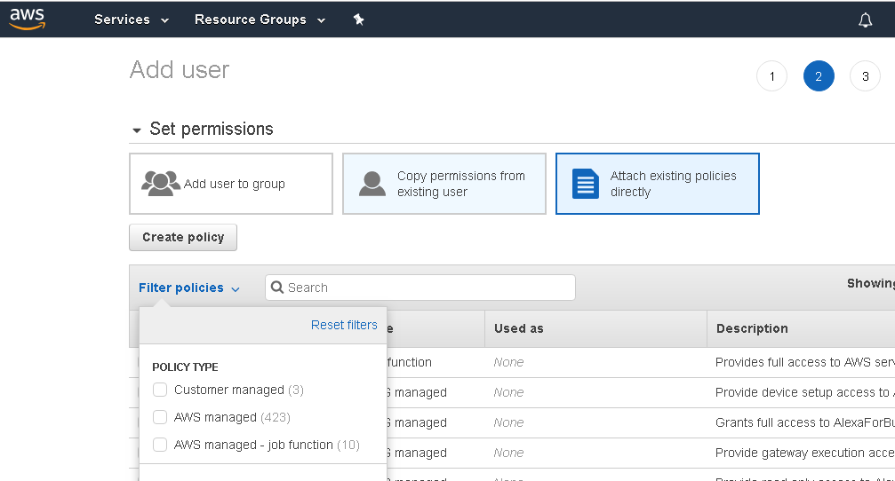

Então selecionar as duas políticas criadas anteriormente, "Travis-Deploy-To-S3" e "Travis-Code-Deploy-Policy" e clicar no botão azul "Next: Tags". Depois clicar em "Next: Review" e finalmente em "Create user".

### 5. Criar IAM Role para instância EC2
Em IAM, clicar em "Roles" e depois clicar no botão azul "Create role". Em "Select type of trusted entity" selecionar "AWS service", em "Choose the service that will use this role" selecionar "EC2" e clicar no botão azul "Next: Permissions".

Clicar em "Filter policies", selecionar "Customer managed", selecionar nossa primeira política criada "CodeDeploy-EC2-Permissions" e clicar no botão azul "Next: Tags". Depois clicar em "Next: Review", dar um nome para o IAM Role como "CodeDeploy_EC2_DEPLOY_INSTANCE" e finalmente clicar em "Create role".


### 6. Criar IAM Role para a aplicação AWS CodeDeploy
Em IAM, clicar em "Roles" e depois clicar no botão azul "Create role". Em "Select type of trusted entity" selecionar "AWS service", em "Choose the service that will use this role" selecionar "Codedeploy", em "Select your use case" selecionar "Codedeploy" e clicar no botão azul "Next: Permissions". Depois clicar em "Next: Tags", depois em "Next: Review", dar um nome para o IAM Role como "CodeDeployServiceRole" e finalmente clicar em "Create role".

### 7. Criar a instância EC2
Em "Find Services" no AWS Management Console, procurar por "EC2". 


No EC2 Dashboard clicar no botão azul "Launch Instance". Selecionar a Amazon Machine Image. Nesse tutorial vamos utilizar o Ubuntu Server. Clicar no botão azul "Select" correspondente.

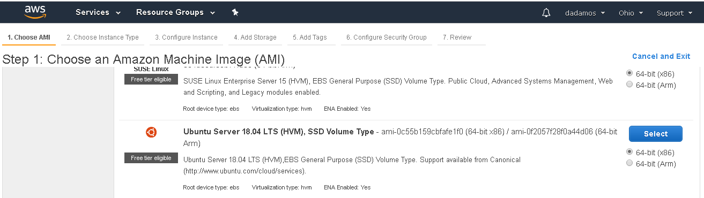

Depois clicar no botão "Next: Configure Instance Details" e selecionar o role "CodeDeploy_EC2_DEPLOY_INSTANCE" criado anteriormente para a instância EC2 em IAM role e clicar no botão "Next: Add Storage":

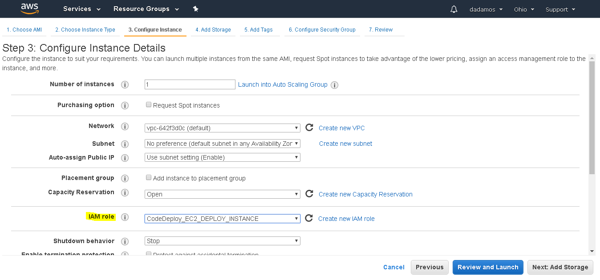

Clicar no botão "Next: Add Tags" e depois no botão "Add Tag" e dar uma Key e um Value de sua preferência. Clicar no botão azul "Review and Launch" e finalmente clicar no botão azul "Launch".

### 8. Criar o S3 Bucket
Em "Find Services" no AWS Management Console, procurar por "S3".
Clicar no botão azul "Create bucket", entrar com um nome para o bucket, clicar "Next", "Next", "Next" e por fim em "Create bucket".

### 9. Configurar o CodeDeploy
Em "Find Services" no AWS Management Console, procurar por "CodeDeploy" e então clicar no botão laranja "Create application". 
Em "Application name" colocar o "NOMEAPLICACAOCODEDEPLOY" escolhido no passo 3.2.2, em "Compute platform" escolher "EC2/On-premises" e clicar no botão laranja "Create application".

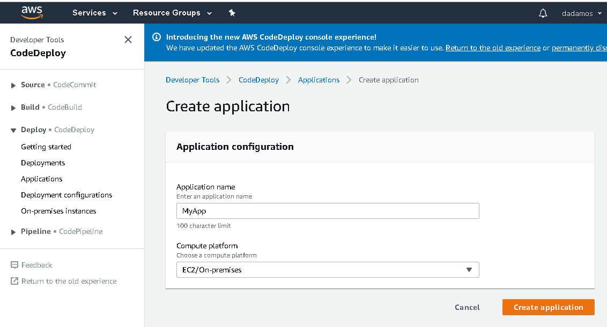

Após a criação da aplicação, você será direcioando para a tela de detalhes da aplicação. Então clicar no botão laranja "Create deployment group":

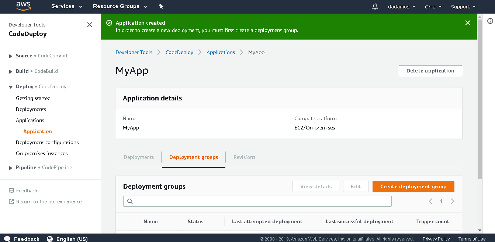

Em "Deployment group name" entre com um nome de sua escolha e em "Service Role" selecionar o IAM Role "CodeDeployServiceRole" criado no passo 6.

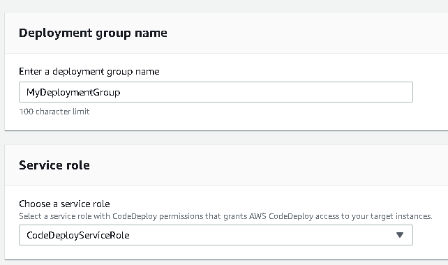

Em "Environment configuration" selecionar "Amazon EC2 instances" e adicionar a Key e o Value da Tag criada no passo 7.

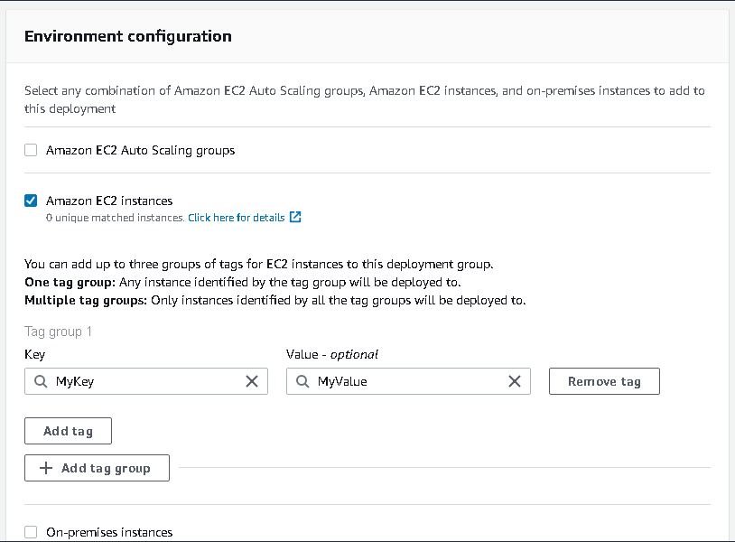

Em "Load balancer" deselecione "Enable load balancing" e clique no botão laranja "Create deployment group".

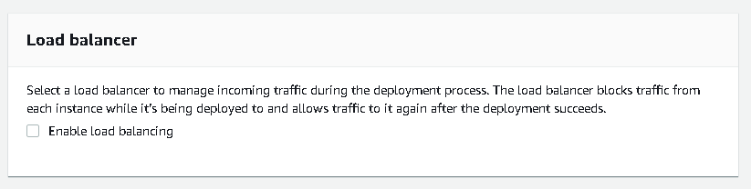

Por enquanto terminamos com as configurações no AWS Management Console (ufa). Faltou configurar o security group da instância (para que ela possa ser exposta para o mundo) e criar mais instâncias para usarmos no nosso Swarm, mas faremos isso futuramente. (Passo X.X e X.X)

### 10. Configurar o projeto

#### 10.1 travis.yml
```
```
#### 10.2 appspec.yml
```
```
### 11. Configurar as credenciais de usuário no Travis

### 12. Configurar o CodeDeploy Agent

## Referências
