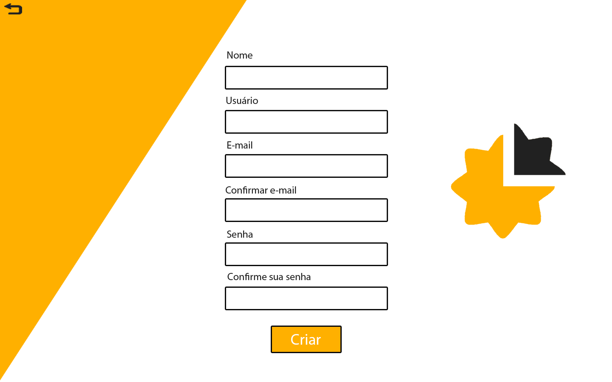
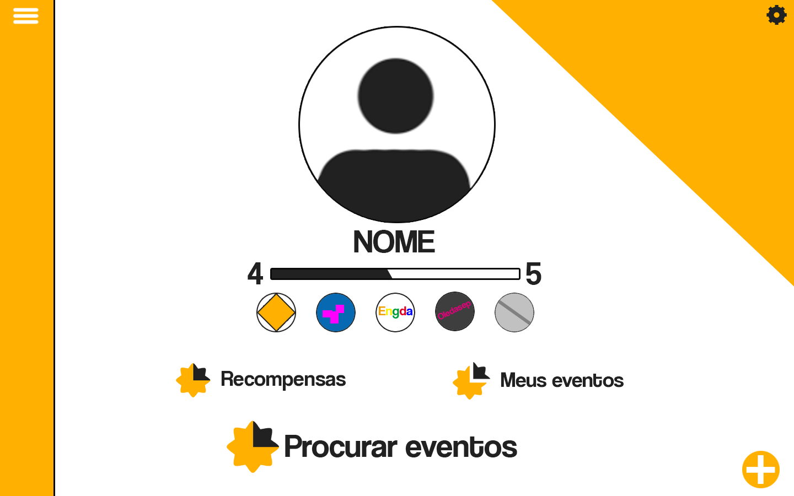
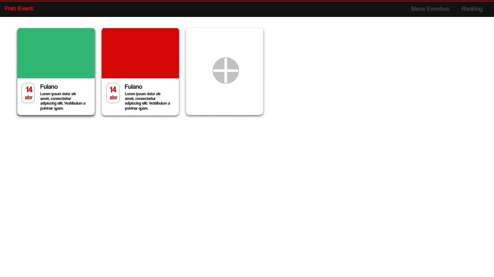
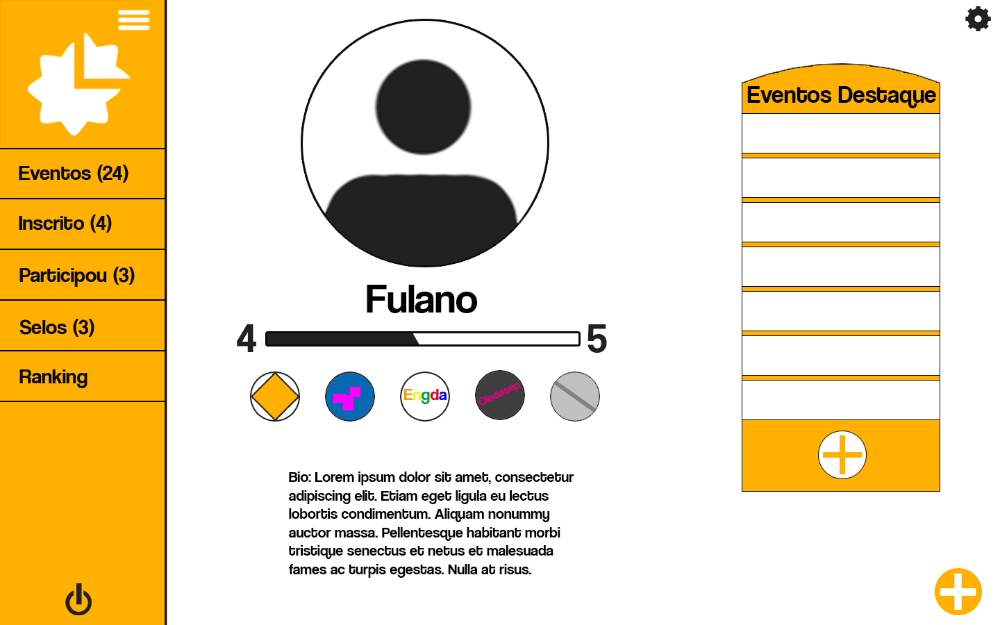
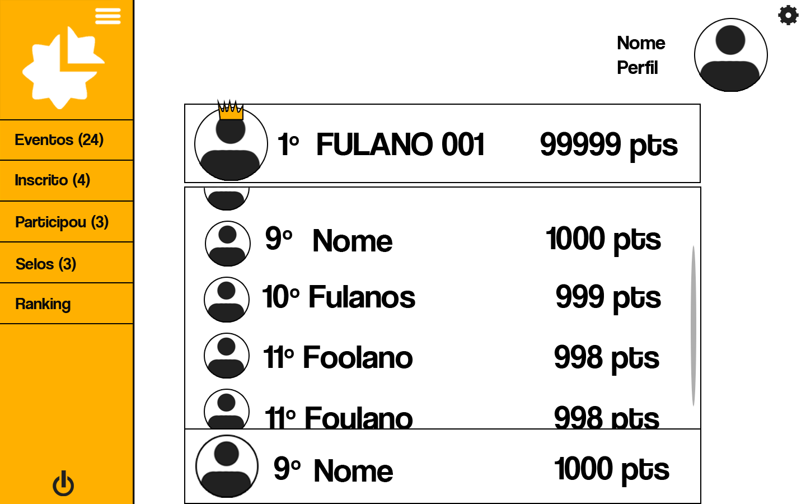
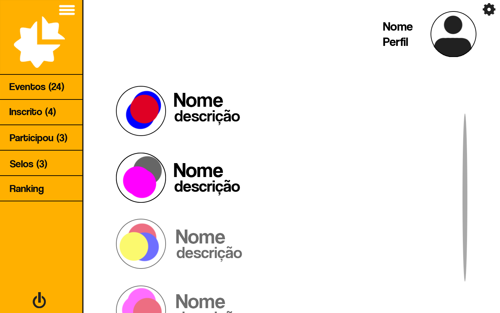

<h1> Protótipo de Alta Fidelidade </h1>

Legenda 1 - Tela de Login.

 

Legenda 2 - Tela de Cadastro.

 

Legenda 3 - Home/Dashboard.

 

Legenda 4 - Tela de eventos .

 

Legenda 5 - Tela de criação de eventos.

 

Legenda 6 - Tela de Criação de icones de evento.

 

Legenda 7 - Tela de Perfil.

 

Legenda 8 - Tela de Ranking.

 

Legenda 9 - Tela de Archievments.

 
