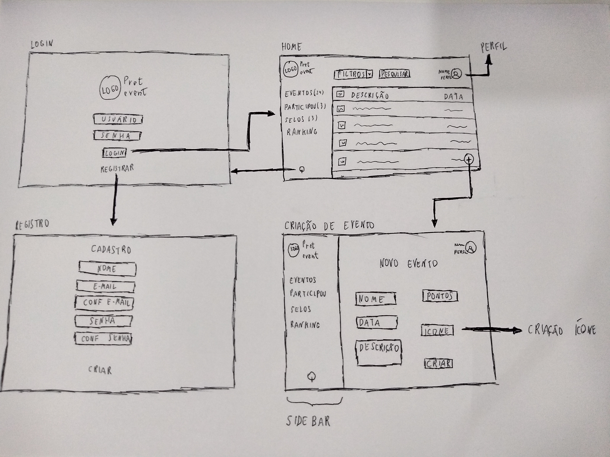
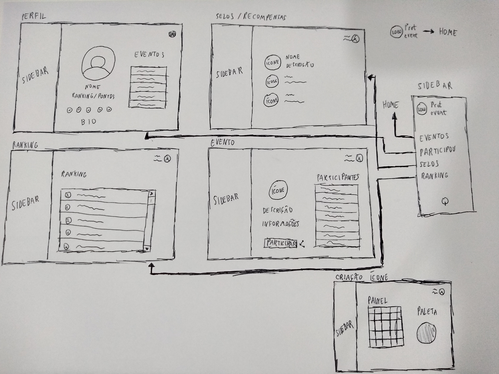

<h1> Protótipo de Baixa Fidelidade </h1>

Legenda 1 - Protótipo de baixa fidelidade apresentando as telas principais do *web app*.

 

Legenda 2 - Protótipo de baixa fidelidade apresentando outras telas do *web app*.

