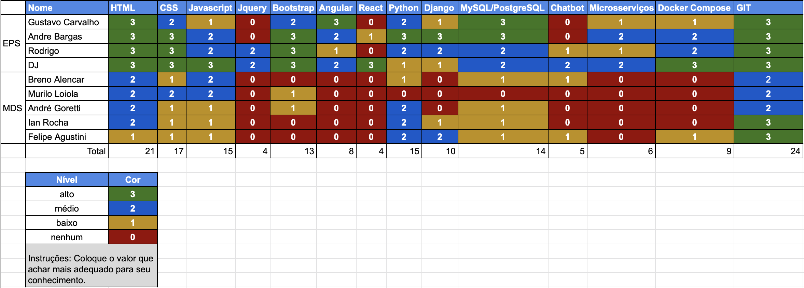

# Resultado Sprint 0

## 1. Indicadores de Qualidade do Processo

### 1.1 Fechamento da _Sprint_

**Pontos Concluídos:** 15

| Tarefas | Status |
|:-------:|:--:|
| T01 | Concluída |
| T02 | Concluída |
| T03 | Concluída |
| T04 | Concluída |
| T05 | Concluída |
| T06 | Concluída |
| S01 | Concluída |
| S02 | Concluída |

### 1.2 Retrospectiva

|Membro|Pontos Positivos|Pontos Negativos|Sugestões de melhoria| Pontuação das histórias |
|---|------|-----|---|---|
|Djorkaeff Alexandre| As tarefas foram concluídas da forma esperada.|Negligenciaram o template de issue.| Delegar as tarefas. |Boa|
|Rodrigo Dadamos| Equipe está motivada, entrosamento da equipe está aumentando.|Trabalhamos pouco essa semana. | Maior dedicação. |Boa |
|Gustavo Carvalho| Proatividade do time de MDS.| A falta de organização nas tarefas e issues. | Conhecimento da equipe, rastreabilidade das tarefas. |Boa |
|André Bargas| Escopo definido e ambiente de desenvolvimento pronto.|Poucas entregas e os reviews estão demorando, e não começamos a codar.| Entrega contínua, comunicação e ter mais resultados. |Boa |
|Ian Rocha| Aprendizado, experiência de trabalhar em equipe.|O medo de estar atrasado, e o compromentimento de MDS. | Melhorar a proatividade de todos, definir quem vai fazer cada tarefa. |Boa |
|Felipe Agustine| Comunicação do time.|Desorganização das branches.| Divisão de tarefas e eficiência |Boa
|Murilo Loyola| Orientação e esclarecimento por parte de EPS e o design da logo.|MDS rendeu pouco, podia ter feito mais.| Delegar melhorar as tarefas. |Boa |
|André Goretti| Pessoal de EPS é colaborativo e o escopo do projeto é legal.|Confuso dentro das issues e trabalhar pouco.| Agilidade para fechar as issues. |Boa
|Breno Bezerra| Aprender python e GIT.|Ainda não fiz nada.| Fazer algo. | Boa |

### 1.3 Quadro de Conhecimento

## 2. Análise do _Scrum Master_

Ocorreram reuniões diárias (dailys) via <i>Slack</i>, algumas tarefas foram comprometidas por falta de organização e divisão de tarefas nas reuniões, as tarefas foram mal delegadas na primeira reunião, não foi usado o Zenhub por isso não tivemos um gráfico de burndown.

No final, todas as tarefas planejadas conseguiram ser entregues, a <i>sprint</i> serviu de iniciação para os desenvolvedores.
