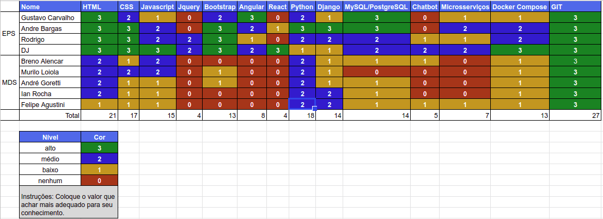

# Resultado Sprint 0

## 1. Indicadores de Qualidade do Processo

### 1.1 Fechamento da _Sprint_

**Pontos Concluídos:** 15

| Tarefas | Status |
|:-------:|:--:|
| T11 | Concluída |
| T13 | Concluída |
| T12 | Concluída |
| T14 | Concluída |
| T15 | Concluída |
| T08 | Concluída |
| T05 | Concluída |
| T09 | Concluída |
| F01 | **Dívida** |
| T16 | **Dívida** |
| T10 | **Dívida** |

### 1.2 Retrospectiva

|Membro|Pontos Positivos|Pontos Negativos|Sugestões de melhoria| Pontuação das histórias |
|---|------|-----|---|---|
|Djorkaeff Alexandre| Achei que a galerad e MDS esta evoluindo| Issues ainda tem porblemas.| Mais entregas no meio da semana, organização das issues. |Boa|
|Rodrigo Dadamos| Equipe está motivada, entrosamento da equipe está aumentando.| Falta tudo do front. | Equipe fazer issues de front e de back. |Boa |
|Gustavo Carvalho| Proatividade do time de MDS.| Comunicação. | Melhorar a comunicação nas issues. |Boa |
|André Bargas| Muitas issues feitas, galera de MDS está evoluindo, Comecçamos a codificar | Não estamo full-stack ainda.| Equipe de desenvolvimento trabalhar no front também. |Boa |
|Ian Rocha| Documento de manual de identidade ficou muito bem feito| O CRUD não foi 100%. | O CRUD de players |  Boa |
|Felipe Agustini| Galera fez bom trabalho com CRUD.| Perdi metade da semana doente | A entrega continua| Boa
|Murilo Loiola| Issues foram bem defindas, oque ajudou no trabalho.| Outras matérias estão apertadas e estou sem tempo.| Distribuição de responsabilidades. |Boa |
|André Goretti| Bom trabalho em equipe.| Tive problemas com instalação com ubuntu.| Densempenho da equipe. |Boa
|Breno Bezerra| Começamos a codar, uhul!!.|Faltou os testes.| O código. | Boa |

### 1.3 Quadro de Conhecimento

### 1.4 Justificativas Dívidas

 * F01 - Falta de conhecimento experiência.

 * T16 - Alguns problemas para expor porta publica do container de frontend.

 * T10 - Problemas de saúde dos individuos alocados para a tarefa.

## 2. Análise do _Scrum Master_

Ocorreram reuniões diárias (dailys) via <i>Slack</i>, algumas tarefas foram comprometidas por falta de organização e divisão de tarefas nas reuniões, as tarefas foram mal delegadas na primeira reunião, não foi usado o Zenhub por isso não tivemos um gráfico de burndown.

No final, todas as tarefas planejadas conseguiram ser entregues, a <i>sprint</i> serviu de iniciação para os desenvolvedores.

