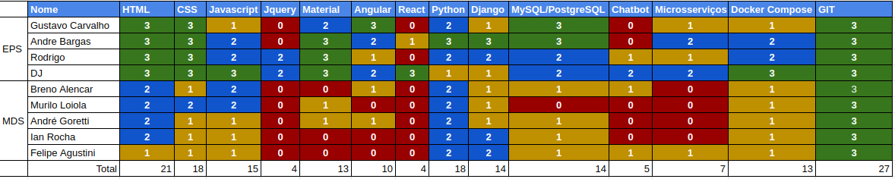

# Resultado Sprint 2

## 1. Indicadores de Qualidade do Processo

### 1.1 Fechamento da _Sprint_

**Pontos Concluídos:** 27

| Tarefas | Pontos | Status |
|:-------:|:------:|:------:|
| F01 |5| Concluída(Débito da sprint 1) |
| F02 |5| **Dívida** |
| F05 |3| Concluída |
| F15 |3| Concluída |
| T10 |2| Concluída(Débito da sprint 1) |
| T16 |3| Concluída(Débito da sprint 1) |
| T19 |8| Concluída |
| T22 |1| Concluída|
| T23 |2| Concluída|

### 1.2 Retrospectiva

|Membro|Pontos Positivos|Pontos Negativos|Sugestões de melhoria| Pontuação das histórias |
|---|------|-----|---|---|
|Djorkaeff Alexandre| Autonomia de MDS para conseguir entregar tarefas do back-end| Não criei issues para as minhas atividades| Mais entregas no meio da semana, organização das issues. |Boa|
|Rodrigo Dadamos| Consegui fazer integração continua até o deploy, estudos renderam| Falta de tempo para implementar pipeline para aws | Fechar mais issues de forma constante |Boa |
|Gustavo Carvalho| MDS teve proatividade para a resolulção de problemas| Organização das tarefas e fechamento das issues. MDS não está comentando as issues | Ser mais ágil |Boa |
|André Bargas| Muitas issues feitas, galera de MDS está evoluindo, Comecçamos a codificar | Não estamo full-stack ainda.| Equipe de desenvolvimento trabalhar no front também. |Boa |
|Ian Rocha| Documento de manual de identidade ficou muito bem feito| O CRUD não foi 100%. | O CRUD de players |  Boa |
|Felipe Agustini| Galera fez bom trabalho com CRUD.| Perdi metade da semana doente | A entrega continua| Boa
|Murilo Loiola| Issues foram bem defindas, oque ajudou no trabalho.| Outras matérias estão apertadas e estou sem tempo.| Distribuição de responsabilidades. |Boa |
|André Goretti| Bom trabalho em equipe.| Tive problemas com instalação com ubuntu.| Densempenho da equipe. |Boa
|Breno Bezerra| Consegui aprender Angular|Tive problemas com a internet| - | Boa |

### 1.3 Quadro de Conhecimento

### 1.4 Justificativas **s

F02** - Houve uam discordância de como seria guardado a foto do usuário no nosso sistema, e isso atrasou a entrega da feature por completo, sendo a mesma classificada como dívida para a próxima sprint.
F15 - Falta de conhecimento atrasou a entrega da mesma.  

## 2. Análise do _Scrum Master_

Houve um uma melhora significativa no conhecimento de MDS, e isto resultou no fechamento de features que estavam como débito da sprint passada.

A falta de planejamento da sprint fez com que todas as atividades propostas fossem finalizadas somente no último dia da sprint, com isso o burndown teve uma queda repentina.

 Um risco foi adcionado no projeto, uma vez que optamos por usar os serviços da google para armazenamento de nossas imagens. Tivemos que estudar para aplicação de tal, oque causou o atraso da feature "F02 - Formulário de cadastro de player".