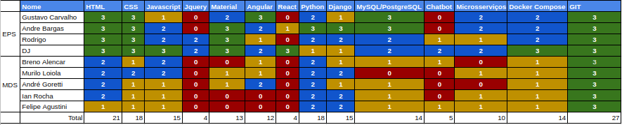

# Resultado Sprint 5

## 1. Indicadores de Qualidade do Processo

### 1.1 Fechamento da _Sprint_

**Pontos Concluídos:** 11

| Tarefas | Pontos | Status |
|:-------:|:------:|:------:|
|F18 - Login de usuário no front|5|Concluído|
|T38 - Linkar recompensa com evento no cliente|3|Concluído|
|T39 - Consertar vulnerabilidades|1|Concluído|
|T36 - Criar serviço de redirecionamento e de alert para sucesso e erros.|2|Concluído|

### 1.2 Retrospectiva

|Membro|Pontos Positivos|Pontos Negativos|Sugestões de melhoria| Pontuação das histórias |
|:---:|:------:|:-----:|:---:|:---:|
|Djorkaeff Alexandre|Acho que o time tá mais motivado depois da release 1.|O time de MDS parece ter receio de chamar a galera de EPS pra ajudar em algo e isso tá atrasando em muito o fechamento das tarefas. Por vezes não estão nem mesmo tentando realizar.|MDS deve fazer mais coisas.|Boa|
|André Goretti|Esforço pra fazer uma boa apresentação.|Nada.|Aprender mais algumas coisas de Angular.|Boa|
|Felipe Agustini|Terminamos o que pretendíamos pra R1.|Ainda falta uma tonelada de coisa.|Rever os pontos que as professoras cobraram.|Boa|
|Murilo Loiola Dantas|Finalização da release 1.|Produtividade no frontend.|Pareamento presencial.|Boa|

### 1.3 Quadro de Conhecimento

### 1.4 Justificativas Dívidas

* T34 - Esta tarefa acabou sendo colocada como baixa prioridade, devido a aproximação da finalização da R1. Com isso a preparação para a apresentação da R1 teve preferência nas atividades.

## 2. Análise do _Scrum Master_

&emsp;&emsp;Esta tarefa teve como foco as revisões e refatorações no repositório e preparação para apresentação da R1. Muitas dessas tarefas eram pequenas e quase não foram documentadas, gerando assim uma baixa movimentação de tarefas no nosso quadro Kanban. 
