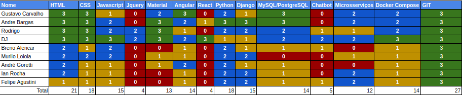

# Resultado Sprint 8

## 1. Indicadores de Qualidade do Processo

### 1.1 Fechamento da _Sprint_

**Pontos Concluídos:**

|Tarefas|Pontos|Status|
|--|:--:|:--:|
|T47 - Review de documentos de sprint |1|Concluído|
|T46 - Revisar Documento |3|Concluído|

### 1.3 Quadro de Conhecimento

<!--  -->

### 1.4 Justificativas Dívidas

Não teve dívidas.

## 2. Análise do _Scrum Master_

&emsp;&emsp; Assim como foi dito no planejamento desta sprint, devido os compromentimentos da esquipe fora do projeto não foi planejado muitos pontos para esse ciclo de trabalho, porém os poucos que estavam no backlog da sprint foram feitos.

